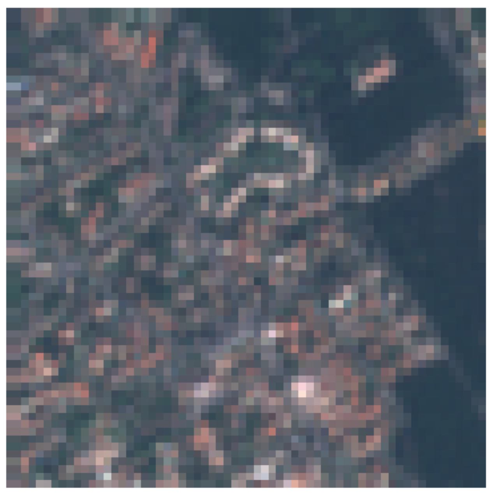

# Satellite Image Classification - Eurosat
This project was part of the UNISG CS Master's course "Machine Learning" (HS24).
It was in form of a competition hostet on Kaggle.

## Challenge
The challlenge is to do Land Use and Land Cover Classification on the EuroSAT Sentinel-2dataset https://github.com/phelber/EuroSAT.

## Methodology
- Use a Conditional Generative Adversarial Network (cGAN) Pix2Pix for image-to-image translation.
- Use a Deep Neural Network ResNet50 for the image classification.

## Datasets and Problem
- The original Eurosat Dataset contains 27'000 13x64x64 pixel images with 10 classes.
- The pictures come in 13 spectral bands:

    

- Example of Sentinel-2 Multi Spectral Imaging:

    

- Sentinel-2 gives the image products.
    - Level-1C: Top of the atmosphere reflectance.
    - Level-2A: Bottom of the atmosphere reflectance without B10 Cirrus.

### Challenge Dataset:
    - Training Dataset:
        - Eurosat
        - Level-1C
        - 13 Bands
    - Test Dataset:
        - Atomispheric Correction
        - Level-2A
        - 12 Bands
        - Without B10 Cirrus
        - 4'200 images

### Problem:
- **There is no Level-2A data for the training set available!**

### Major TOM:
- Major TOM is another dataset from esa that does have Level-1C and Level-2A data:

       Level 1C                               Level 2A
        

### Training Data and Major TOM:
| Original Training Image 1C | Major TOM 1C Equivalent | Major TOM 2A Equivalent |
|:----------------------:|:----------------------:|:----------------------:|
|  |  |  |

## Data Preprocessing
- Because of the difference between 1C and 2A data, a new dataset is created based on Major TOM.
- This **AB Dataset** contains paired images that contain the exact same image depicted on both levels (this is called AB, with A being the L1C and B being the L2A image).
- Each 1068x1068 Major TOM image (~3'600 images in total) can be cut up into 256 smaller 64x64 patches. 
    -  Save them in a folder with multiple MajTOM_test_*.zip and MajTOM_train_*.zip files, each containing the patches from 500 Major TOM images.

- The same is done for the original training and testing set in the exact same AB format as described above.
    - each training image is stored as a Training-BlackImage (AB)
    - each testing image is stored as a Testing-BlackImage (AB)

## Conditional Generative Adversarial Network (cGAN) with Pix2Pix
- Conditional GANs learn: **G : {x, z} → y**
    - x: input image
    - z: random noise (dropout in multiple generator layers is used as noise)
    - y: output image

    

- Used for image-to-image translation between paired images.

    

- Benefits from mix with traditional loss (Generator additional task to be near ground truth output)

    

### Pix2Pix
- Generator:
    - **U-Net based architecture**
    - Encoder-decoder with skip connections that allow to shuttle shared low-level information (circumvents inherent information bottleneck). 
    - The contracting path downsamples (capture complex features at reduced dimensions), the expansive path upsamples back to the original dimension.
    - We define 4 input and 4 output channel and downsample 6 times (i.e. images 1x1 at bottleneck) 
    - Blocks are combinations of Conv2d, LeakyReLU, normalization/droput layers and ConvTranspose2d

    

- Discriminator:
    - **Convolutional PatchGAN**
    - By evaluating small localized patches independently, this is focussing on local structures. 
    - We define 2 layers which are combinations of Conv2d and LeakyReLU

    

    
### Learning on Major TOM
- A pytorch implementation of Pix2Pix from Github is used. 
- This implementation is suited for 256x256 RGB images, which is why we introduce a few changes in the library to use the model for our 64x64 patches with 4 channels.
- 80'000 images from the Major TOM AB dataset are used for training.
- The model was trained for only a few epochs due to the large amount of training data.
#### CGAN Loss:
- G_GAN is the generator GAN loss and measures how well the generator is able to fool the discriminator. A lower G_GAN loss indicates that the generator is improving in its ability to create realistic images.
- G_L1 is the generator L1 loss between the generated images and the real images. It encourages the generator to produce output closer to the real images.
- D_real and D_fake are the discriminator real and fake loss, which measure how well the discriminator is able to recognize real images as real and generated images as fake. Lower losses indicate that the discriminator is improving its ability to discriminate generated images.
- Ideally, all losses should be reasonably low. However, as often in GANs, they do not converge (see [link](https://github.com/junyanz/pytorch-CycleGAN-and-pix2pix/blob/master/docs/qa.md)). Only the G_L1 should go down over time, which it slightly does in our case (see [link](https://github.com/phillipi/pix2pix/issues/21)).

    

#### Test Results on Major TOM:
- This model was now with the same specifications used on 50 test images which were save to a folder.

- The results show that it worked quite well.

| | | |
|:----------------------:|:----------------------:|:----------------------:|
|  |  |  |

### Transform our real training data
- We now use the trained model to transform our real training data (27'000 L1C images to 27'000 L2A images).
- Similar as in the test, the results are saved in a folder.
#### Results of our training data:
- We see that the translation from A to B nicely worked.

**note: realB is black because it does not exist as explained above**

| | | |
|:----------------------:|:----------------------:|:----------------------:|
|  |  |  |

## Train the image Classifier on our transformed training data
- A imagenet pretrained ResNet50 is used as image classifier.
- Training data is split into 70% training, 15% validation and 15% testing.
- Adapted the first and last layer to 4 channel images.
- To prevent overfitting, we use dropout before the last layer.
- Change last layer to 10 output features (10 classes).
- We train for 10 epochs.
- Total params 23,521,418

    

### losses
- Losses converge to each other and zero.
- Validation accuracy is relatively stable.

    

## Make predictions on the test set
- The accuracy on the test set is **64%**
- This made as 4th in the competition.
